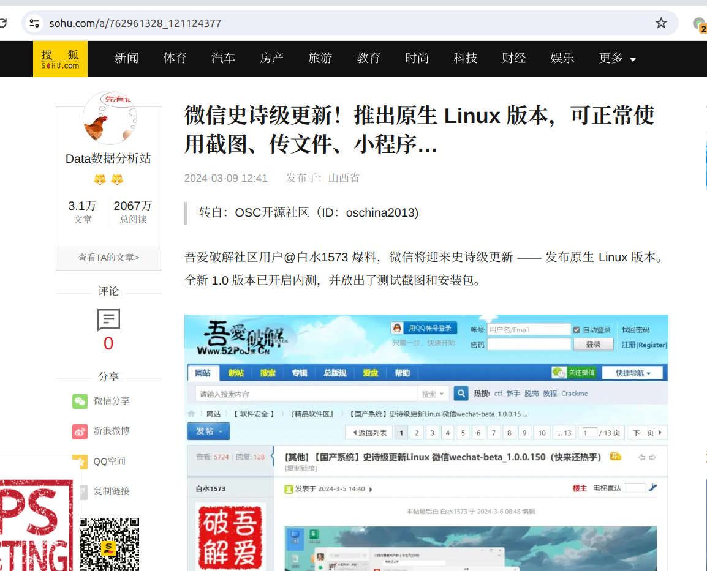
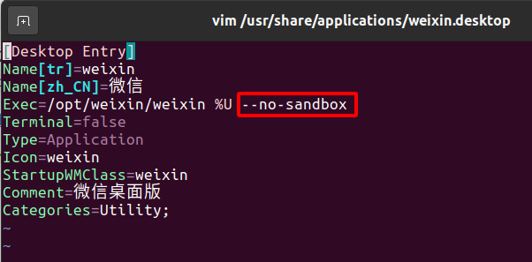

# wechat_for_linux

# 终于出官方版本微信了
# https://linux.weixin.qq.com/


# ===================== 分割线 =====================
# ==================== 以下废弃 ====================

## 更新

好好好，再也不骂腾讯和微信了，终于出了好用的官方版本微信了。




安装包丢在Releases中了，一共三个版本：

wechat-beta_1.0.0.145_amd64.deb

wechat-beta_1.0.0.150_arm64.deb

wechat-beta_1.0.1.212_loongarch64.deb


## 我可没骂过腾讯和微信

=================我是分割线============================

`我只能说腾讯的产品都是垃圾，linux版破微信就web套壳还要搞系统限制`

wechat_for_linux；weixin_for_linux；

ubuntukylin版本的微信（wechat），亲测可以在ubuntu20.04使用：

```
文件：weixin_2.1.1_amd64.deb
md5：d6827fc8a0a86ac88a3fd0068700095e
```

2021年12月31日，腾讯更新了UOS版本微信（年更），ubuntu下以前修改版的wechat-uos无法登录了，新uos的客户端会提示`user kv not init.`报错，找了找ubuntukylin的新客户端包可以在ubuntu20.04下使用：

http://archive.ubuntukylin.com/ubuntukylin/pool/partner/weixin_2.1.1_amd64.deb

root用户使用前需要修改`vim /usr/share/applications/weixin.desktop`增加--no-sandbox：



**其他内核版本的，arm版本的可参考**：https://github.com/lovechoudoufu/wechat_for_linux/issues/1
